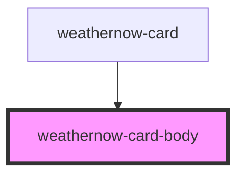

# weathernow-card-body

<!-- Auto Generated Below -->

## Properties

| Property           | Attribute           | Description | Type                          | Default     |
| ------------------ | ------------------- | ----------- | ----------------------------- | ----------- |
| `error`            | `error`             |             | `boolean`                     | `undefined` |
| `loading`          | `loading`           |             | `boolean`                     | `undefined` |
| `temperature`      | `temperature`       |             | `string`                      | `undefined` |
| `temperatureColor` | `temperature-color` |             | `"blue" \| "orange" \| "red"` | `undefined` |

## Events

| Event        | Description | Type               |
| ------------ | ----------- | ------------------ |
| `retryEvent` |             | `CustomEvent<any>` |

## Dependencies

### Used by

 - [weathernow-card](../weathernow-card)

### Graph

----------------------------------------------

*Built with [StencilJS](https://stenciljs.com/)*
