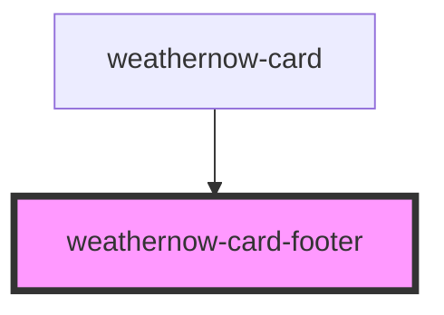

# weathernow-card-footer

<!-- Auto Generated Below -->

## Properties

| Property     | Attribute     | Description | Type      | Default     |
| ------------ | ------------- | ----------- | --------- | ----------- |
| `humidity`   | `humidity`    |             | `string`  | `undefined` |
| `isActive`   | `is-active`   |             | `boolean` | `undefined` |
| `lastUpdate` | `last-update` |             | `string`  | `undefined` |
| `pressure`   | `pressure`    |             | `string`  | `undefined` |

## Dependencies

### Used by

 - [weathernow-card](../weathernow-card)

### Graph

----------------------------------------------

*Built with [StencilJS](https://stenciljs.com/)*
