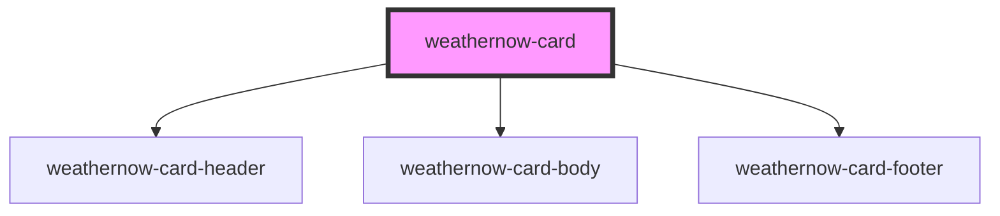

# weathernow-card

<!-- Auto Generated Below -->

## Properties

| Property            | Attribute              | Description | Type                          | Default     |
| ------------------- | ---------------------- | ----------- | ----------------------------- | ----------- |
| `error`             | `error`                |             | `boolean`                     | `undefined` |
| `humidity`          | `humidity`             |             | `string`                      | `undefined` |
| `isActiveByDefault` | `is-active-by-default` |             | `boolean`                     | `undefined` |
| `lastUpdate`        | `last-update`          |             | `string`                      | `undefined` |
| `loading`           | `loading`              |             | `boolean`                     | `undefined` |
| `location`          | `location`             |             | `string`                      | `undefined` |
| `pressure`          | `pressure`             |             | `string`                      | `undefined` |
| `temperature`       | `temperature`          |             | `string`                      | `undefined` |
| `temperatureColor`  | `temperature-color`    |             | `"blue" \| "orange" \| "red"` | `undefined` |

## Events

| Event        | Description | Type                  |
| ------------ | ----------- | --------------------- |
| `retryEvent` |             | `CustomEvent<string>` |

## Dependencies

### Depends on

- [weathernow-card-header](../weathernow-card-header)
- [weathernow-card-body](../weathernow-card-body)
- [weathernow-card-footer](../weathernow-card-footer)

### Graph

----------------------------------------------

*Built with [StencilJS](https://stenciljs.com/)*
